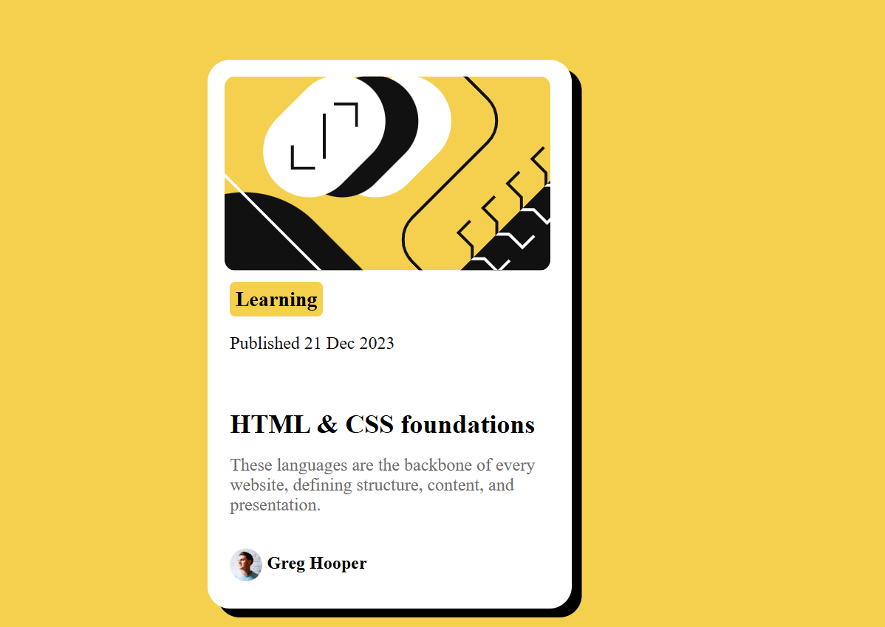

# Frontend Mentor - Blog Preview Card

This is my solution to the [Blog Preview Card challenge on Frontend Mentor](https://www.frontendmentor.io/challenges/blog-preview-card-ckPaj01IcS).  
Frontend Mentor challenges help improve coding skills by building realistic projects.

---

## 📸 Screenshot

---

## 🔗 Links

- **Solution Repo:** [GitHub Repository](https://github.com/Talhaarif326/Blog-Preview-Card-Using-HTML-and-CSS)  
- **Live Site:** [GitHub Pages Demo](https://talhaarif326.github.io/Blog-preview-card/)

---

## 🛠️ Built With

- Semantic **HTML5 markup**  
- **CSS custom properties**  
- **Flexbox**  

---

## 📚 What I Learned

- How to center a card perfectly using **Flexbox**  
- Working with `box-shadow`, `border-radius`, and spacing  
- Creating a simple **responsive-friendly layout**  

css
.container {
  display: flex;
  justify-content: center;
  align-items: center;
  min-height: 100vh;
}

## 🙌 Useful Resources

- [MDN Web Docs - Flexbox](https://developer.mozilla.org/en-US/docs/Web/CSS/flex) – Clear explanation and examples of how Flexbox properties work.  
- [CSS Tricks Flexbox Guide](https://css-tricks.com/snippets/css/a-guide-to-flexbox/) – My go-to cheat sheet whenever I need quick reference for Flexbox.  
- [Google Fonts](https://fonts.google.com/) – For selecting and embedding fonts easily into the project.  
- [Frontend Mentor Community](https://www.frontendmentor.io/community) – Great place to see how others approach the same challenge and to get feedback.  
- [W3Schools CSS Shadows](https://www.w3schools.com/css/css3_shadows_box.asp) – Helpful for understanding and practicing `box-shadow`.  

---

## 👨‍💻 Author

- [GitHub - Talha Arif](https://github.com/Talhaarif326)  
- [Frontend Mentor - @Talhaarif326](https://www.frontendmentor.io/profile/Talhaarif326)  
- [Twitter - @TalhaArif794](https://twitter.com/TalhaArif794)  
- [LinkedIn - Talha Arif](https://www.linkedin.com/in/talha-arif-247b67291)  
